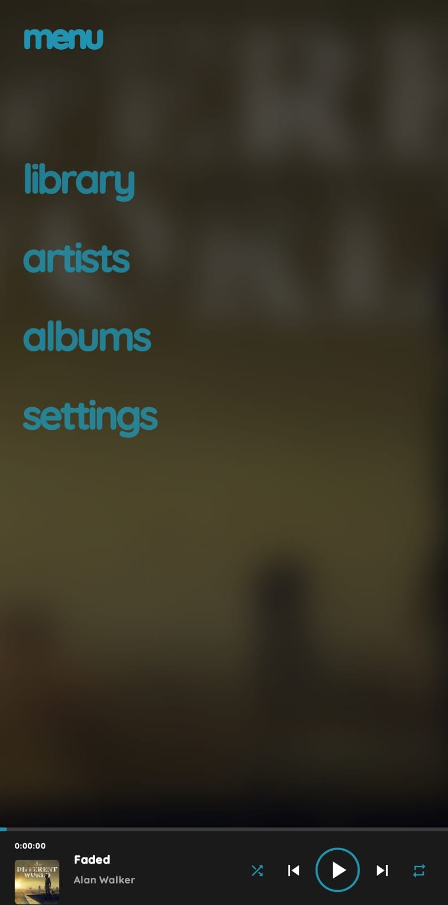
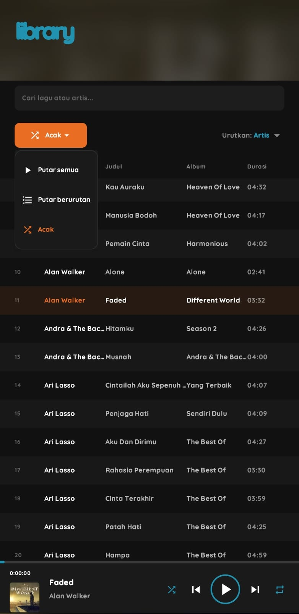
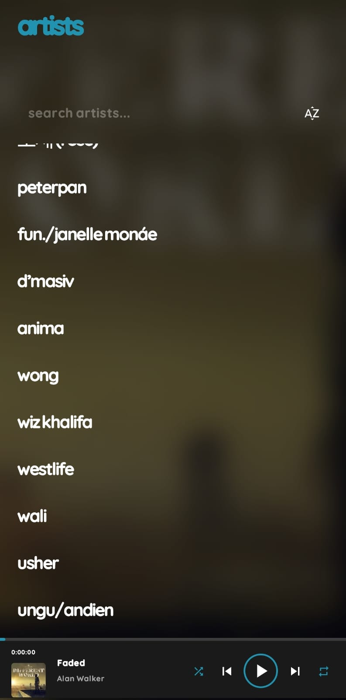
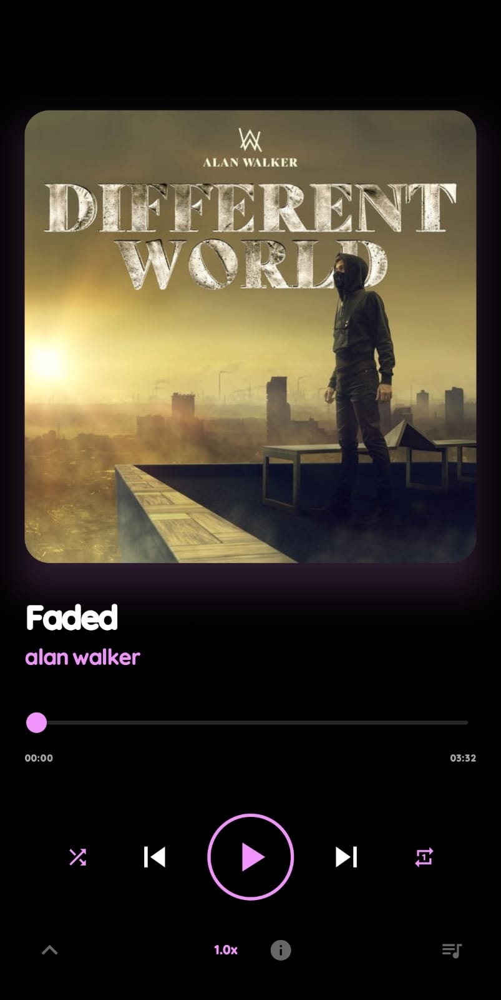

# MedTune

Modern Android music player inspired by Zune HD and Metro UI.

MedTune delivers a lightweight, immersive, and typography-focused music experience powered by the MediaPlay Engine. Built with Jetpack Compose and Media3, the application focuses on smooth playback, adaptive visuals, and minimal UI design.

Overview

MedTune is designed around simplicity, performance, and atmosphere.

Instead of using heavy layouts and complex interfaces, MedTune emphasizes:

* large typography
* adaptive album backgrounds
* smooth scrolling
* minimal interaction layers
* distraction-free navigation

The goal is to create a music player that feels cinematic, modern, and responsive even on mid-range Android devices.

Features

### Playback

* Local music playback
* Queue management
* Shuffle and repeat
* Playback state restoration
* Resume last session
* Adaptive Now Playing screen
* Mini player support

### Adaptive Visual System

* Dynamic album art background
* Adaptive accent colors
* Smart readability system
* AMOLED optimized interface
* Metro-inspired typography
* Dynamic UI atmosphere

### Library

* Songs
* Albums
* Artists
* Search functionality
* Sorting system
* Lightweight list rendering

### Performance

* Optimized Compose rendering
* Reduced unnecessary recomposition
* Efficient album art loading
* Low memory usage
* Smooth animations
* Mid-range device friendly

### Smart Features

* Remember playback position
* Sleep timer
* Persistent playback state
* Adaptive text color
* Dynamic gradient system

## Built With

* Kotlin
* Jetpack Compose
* Media3 / ExoPlayer
* Material 3
* Coil

## Design Language

MedTune is heavily inspired by:

* Zune HD
* Windows Phone Metro UI
* Minimal typography-driven interfaces
* AMOLED-focused visual design

The interface prioritizes:

* readability
* spacing
* motion simplicity
* visual atmosphere
* content-focused navigation

## Architecture

MedTune is powered by the MediaPlay Engine.

Shared systems include:

* playback engine
* media session
* adaptive color engine
* queue management
* widget system
* storage architecture

MedTune itself focuses on:

* immersive UI
* lightweight experience
* Metro-inspired interaction
* visual identity

Performance Philosophy

MedTune is designed to remain lightweight by:

* minimizing heavy blur layers
* reducing nested layouts
* simplifying rendering
* optimizing image cache usage
* prioritizing typography over complex components

## Project Status

Currently under active development.

Developer

Rizqi Tri Antomi

Built with passion for music, Metro UI, and modern Android experiences.

## Screenshots

### Menu

### Library

### Artist

### Play Now

---

## Album

### Album 1

### Album 2

### Album 3

### Album 4

---

## Settings

### Settings 1

### Settings 2

### Settings 3

### Settings 4

### Settings 5

### Settings 6

### Settings 7

### Settings 8

### Settings 9

### Settings 10

